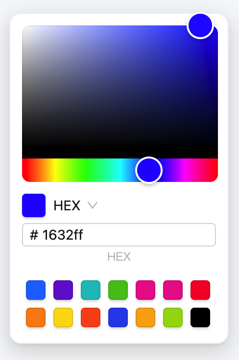

# ant-color-panel 🖥



## Install

```bash
pnpm install ant-color-panel
```

## Usage

```js
import React from 'react';
import { ColorPanel } from 'ant-color-panel';

const Demo = () => {
  const [color, setColor] = React.useState < string > '#1632ff';

  return (
    <React.StrictMode>
      <ColorPanel alpha color={color} onChange={(v) => setColor(v)} />
    </React.StrictMode>
  );
};

export default Demo;
```

## API

| 参数     | 描述           | 类型            | 默认值 | 必填 |
| :------- | :------------- | :-------------- | :----- | :--- |
| color    | 当前选择的颜色 | string          | -      | yes  |
| onChange | 颜色改变的回调 | (color) => void | -      | yes  |
| alpha    | 是否支持 RGB   | boolean         | false  | no   |
| style    | 自定义样式     | CSSProperties   | -      | no   |

## Development

```bash
pnpm install
pnpm dev
```

## License

ant-color-panel is released under the MIT license.
